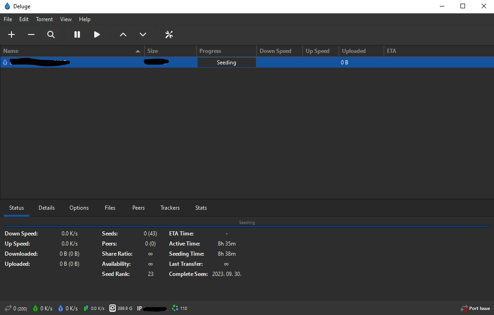

# Deluge Theme changer

The Deluge Theme changer is a simple Python application built using the tkinter library that allows you to easily change the theme of the Deluge client version 2.0 and above. You can switch between a dark theme and a light(default) theme with just a few clicks.




## Features

- Change the theme of your Deluge client quickly and easily.
- Supports both **dark** and **light**(default) themes.
- Provides a user-friendly graphical interface.

## Requirements

Before using the Deluge theme changer, ensure that you have the following:

- Python 3.x installed on your system
- The Deluge client version 2.0 or above installed (was tried on Deluge v2.1.1)

## Installation

1. Clone or download this repository to your local machine.

   ```bash
   git clone https://github.com/yourusername/Deluge-theme-changer.git
   ```

2. Navigate to the project directory.

   ```bash
   cd deluge-theme-changer
   ```

3. Run the application.

   ```bash
   python main.py
   ```

## Usage

1. Run the Deluge theme changer using the steps mentioned in the Installation section.

2. The application will open, and you will see the following options:

   - **Select Deluge Installation Folder:** Click the "Browse" button to choose the folder where your Deluge client is installed. This folder typically contains the `settings.ini` file.

   - **Apply Dark Theme:** Click this button to set the Deluge client to use the dark theme.

   - **Apply Light Theme:** Click this button to set the Deluge client to use the light theme.

   - **Quit:** Click this button to exit the application.

3. After selecting the Deluge installation folder and applying the theme, the application will display a confirmation message indicating that the changes have been applied.

4. You can now launch your Deluge client, and it will use the selected theme (dark or light).

## Notes

- This application is intended for use with Deluge client version 2.0 and above.
- If the `settings.ini` file already exists in the selected Deluge installation folder, the application will ask if you want to override it.

## License

This project is licensed under the MIT License - see the [LICENSE](LICENSE) file for details.

---

**Disclaimer:** This application is not affiliated with or endorsed by the Deluge development team. Use it at your own risk.